# BD_zapateria
Ejercicio creación base de datos de una zapateria en el lenguaje SQL

# Ejercicio de creacion BD 
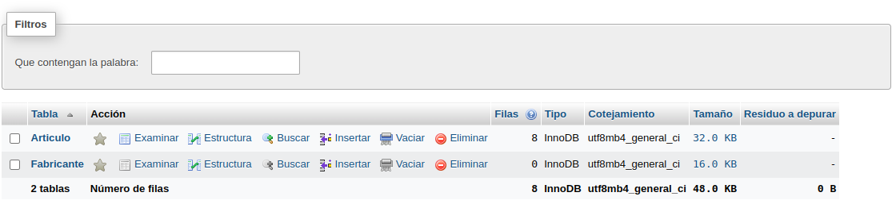

## Base de datos: Zapateria
## Tabla: Fabricante

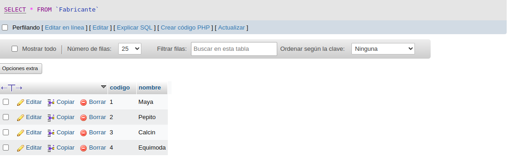

## Tabla Articulo

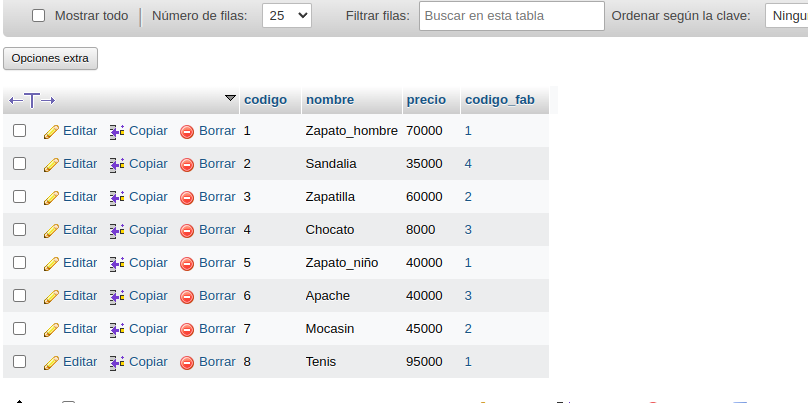

## Tabla Fabricante

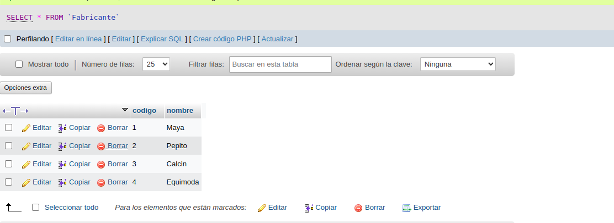

## Modelo Relacion de tablas 

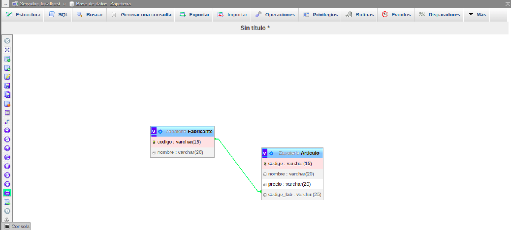

## Consultas 

# Consulta 1

1. Obtener los nombres de los productos de la Zapateria.

`SELECT nombre FROM `Articulo`;`

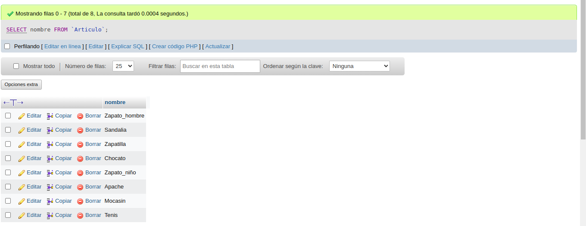

2. Obtener los nombres y los precios de los productos de la Zapatería.

`SELECT nombre,precio FROM `Articulo`;`

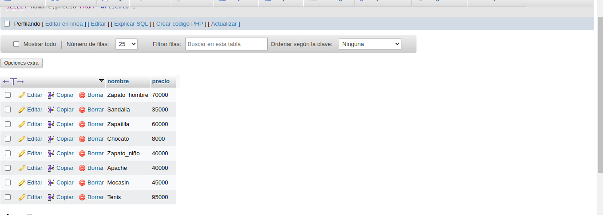

3. Obtener el nombre de los productos cuyo precio sea menor o igual a 50000

`SELECT nombre FROM `Articulo` WHERE precio <= 50000;`

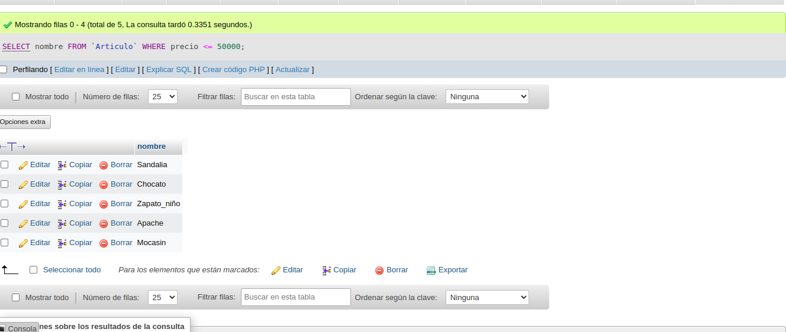

4. Obtener todos los datos de los artículos cuyo precio esté entre 5000 y 40000 (ambas canditades incluidas).

`SELECT * FROM `Articulo` WHERE precio BETWEEN 5000 AND 40000;`

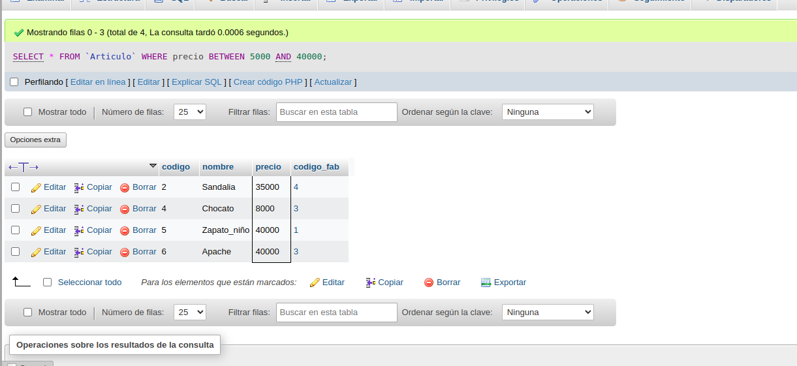

5. Obtener el nombre y el precio de cada artículo, en dolares.

`SELECT nombre, precio / 4242 AS precio_dolares FROM  Articulo;`

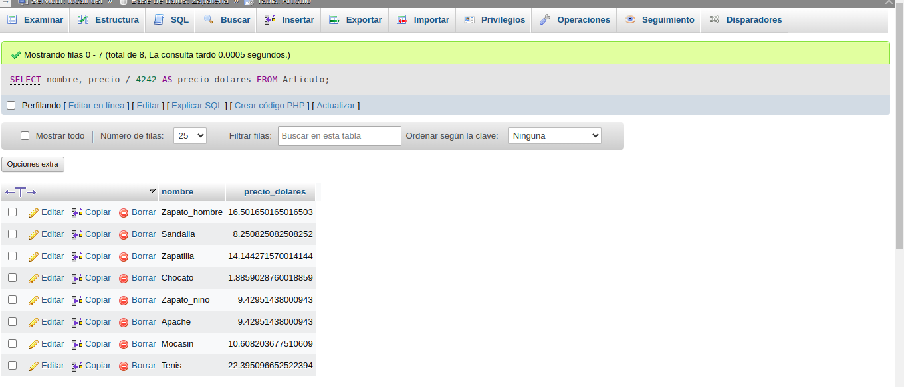

6. Obtener el precio promedio de todos los artículos

`SELECT AVG (precio) AS precio_promedio FROM  Articulo;`

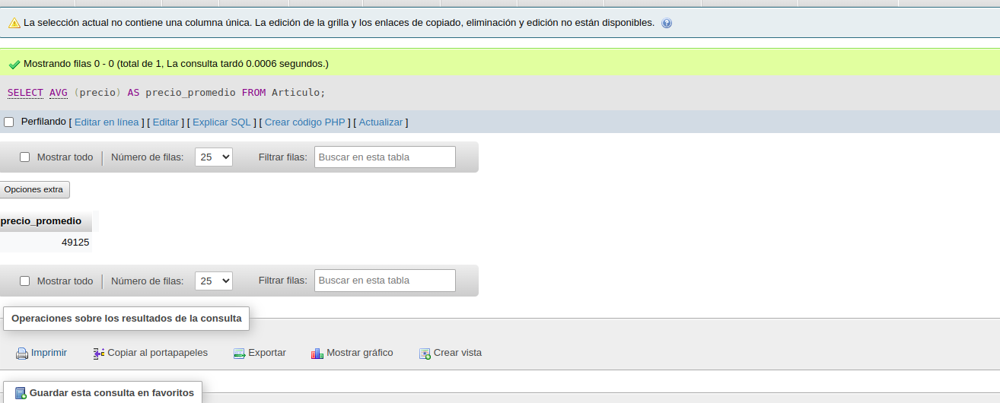

7. Obtener el precio medio de los artículos cuyo codigo de fabricante sea 2.

`SELECT AVG(precio) AS precio_medio FROM Articulo WHERE codigo_fab = 2;`

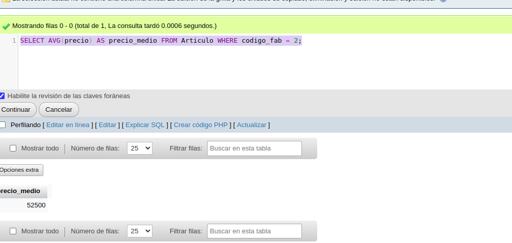

8. Obtener el número de artículos cuyo precio sea mayor o igual a 50000

`SELECT COUNT(*) AS numero_de_articulos FROM Articulo WHERE precio >= 50000;`

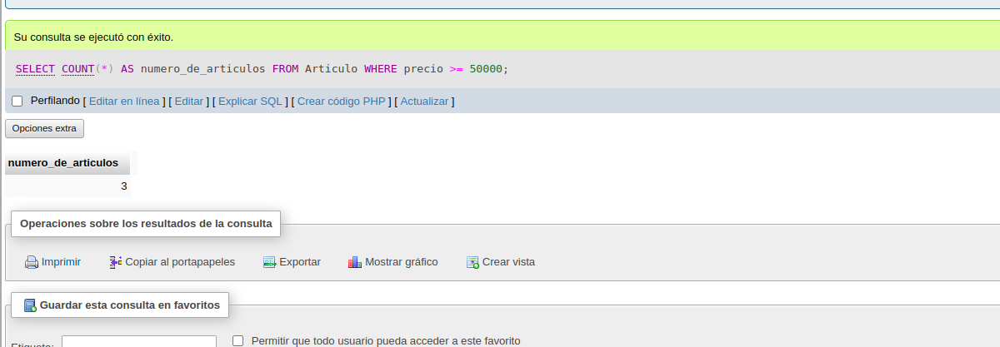

9. Obtener el nombre y precio de los artículos cuyo precio sea mayor o igual a 50000 y ordenarlos descendentemente por precio, y luego ascendentemente por nombre.

`SELECT nombre, precio FROM Articulo WHERE precio>= 50000  
ORDER BY `Articulo`nombre``

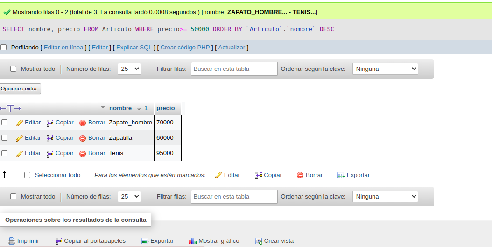

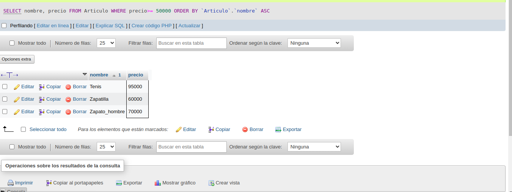

10. Obtener un listado completo de artículos, incluyendo por cada articulo los datos del artículo y de su fabricante.

`SELECT Articulo.*, Fabricante.* FROM Fabricante INNER JOIN Articulo ON Fabricante.codigo=Articulo.codigo_fab;`

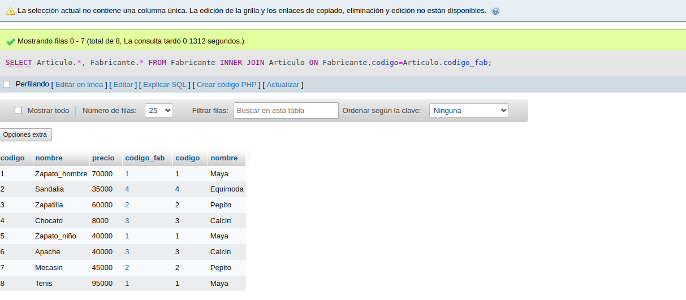

11. Obtener un listado de articulos, incluyendo el nombre del articulo, su precio y el nombre de su fabricante.

`SELECT Articulo.nombre, Articulo.precio, Fabricante.nombre FROM Fabricante INNER JOIN Articulo ON Fabricante.codigo=Articulo.codigo_fab;`

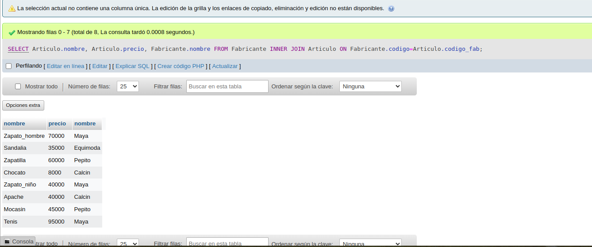

12. Obtener el precio medio de los productos  de cada frabricante, mostrando solo los codigos de fabricante.

`SELECT codigo_fab, AVG(precio) AS precio_medio FROM Articulo GROUP BY codigo_fab;`

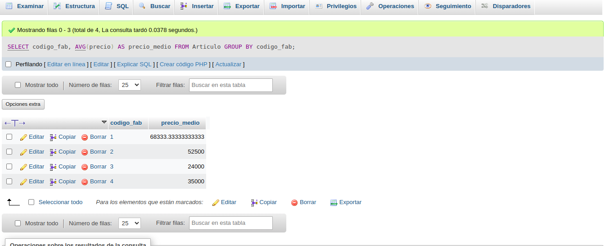

13. Obtener el precio medio de los productos de cada fabricante, mostrando el nombre del fabricante.

`SELECT nombre, AVG(precio) AS precio_medio FROM Articulo GROUP BY nombre;`

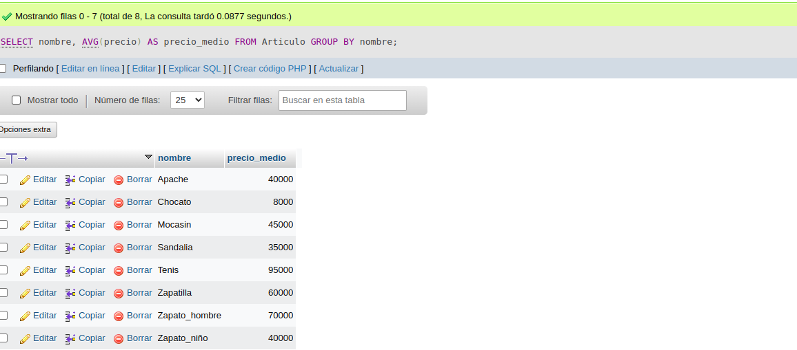

14. Obtener el nombre de los fabricantes que ofrezcan productos cuyo precio medio sea mayor o igual a 50000

`SELECT COUNT(*) as nombre FROM Articulo WHERE nombre >= 50000;`

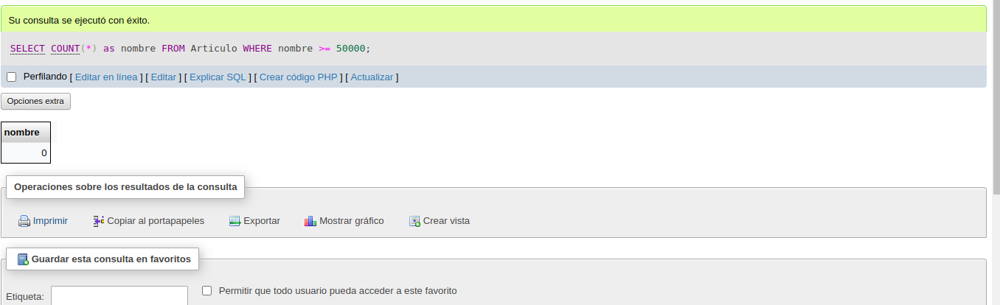

15. Obtener el nombre y el precio del artículo mas barato.

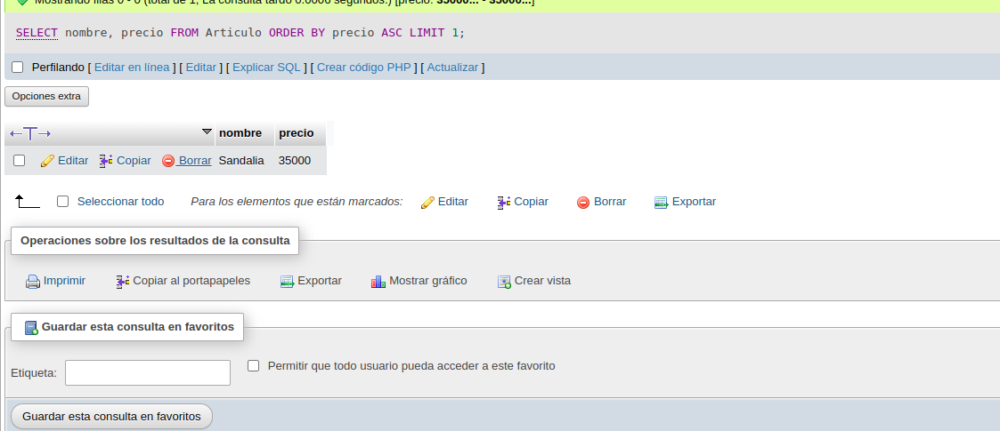

